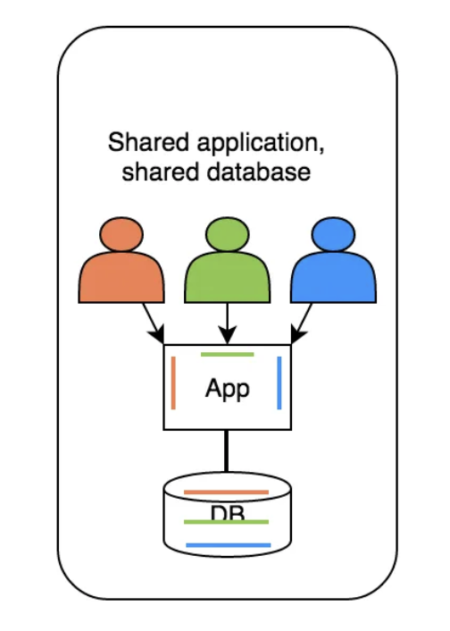
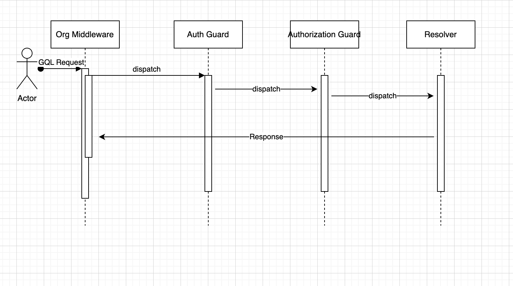
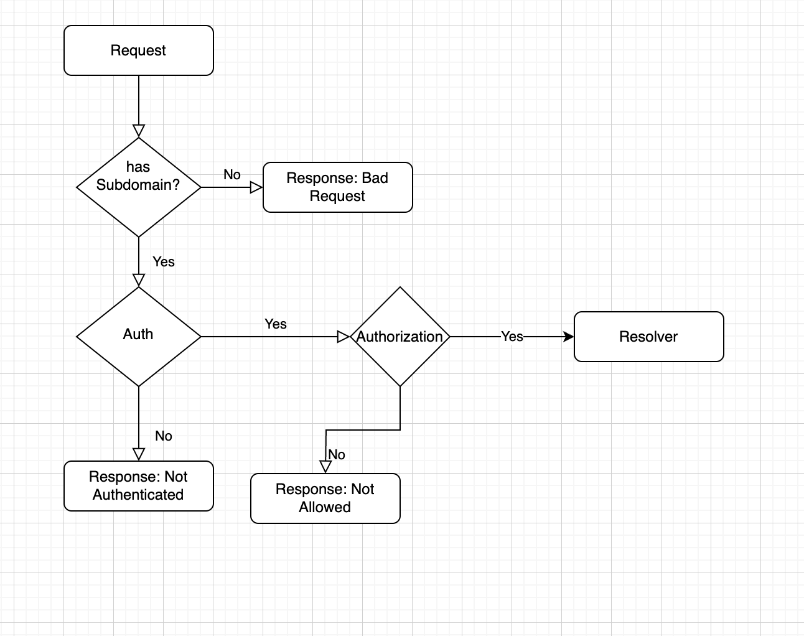

<p align="center">
  <a href="http://nestjs.com/" target="blank"></a>
</p>

[circleci-image]: https://img.shields.io/circleci/build/github/nestjs/nest/master?token=abc123def456
[circleci-url]: https://circleci.com/gh/nestjs/nest

  <p align="center">A progressive <a href="http://nodejs.org" target="_blank">Node.js</a> framework for building efficient and scalable server-side applications.</p>
    <p align="center">
<a href="https://www.npmjs.com/~nestjscore" target="_blank"></a>
<a href="https://www.npmjs.com/~nestjscore" target="_blank"></a>
<a href="https://www.npmjs.com/~nestjscore" target="_blank"></a>
<a href="https://circleci.com/gh/nestjs/nest" target="_blank"></a>
<a href="https://coveralls.io/github/nestjs/nest?branch=master" target="_blank"></a>
<a href="https://discord.gg/G7Qnnhy" target="_blank"></a>
<a href="https://opencollective.com/nest#backer" target="_blank"></a>
<a href="https://opencollective.com/nest#sponsor" target="_blank"></a>
  <a href="https://paypal.me/kamilmysliwiec" target="_blank"></a>
    <a href="https://opencollective.com/nest#sponsor"  target="_blank"></a>
  <a href="https://twitter.com/nestframework" target="_blank"></a>
</p>
  <!--[](https://opencollective.com/nest#backer)
  [](https://opencollective.com/nest#sponsor)-->

## Description

[Nest](https://github.com/nestjs/nest) based Viwell MultiTenant SaaS assignment.
This is a shared application, shared DB multi-tenant application which provides isolation, privacy and security to each organization. Each data records belong to an organization and hence the user can access the data of their own organization only.

## Technologies Used:

- Nest
- GraphQL
- Apollo
- Passport with JWT
- Nest Throttler
- Nest CSRUF
- Helmet
- CORS
- Prisma
- Prisma-NestJS-GraphQL
- Docker Compose
- PostgreSQL

## Directory Structure

/viwell-bk
├── /src
│ ├── /common
│ │ ├── /guards
│ │ └── /middlewares
│ ├── /base-crud
│ │ ├── /base-crud.service
│ │ ├── /base-crud.service.spec.ts
│ ├── /modules
│ │ ├── /<module-name>
│ │ │ ├── /dto
│ │ │ ├── /entities
│ │ │ ├── <module-name.graphql>
│ │ │ ├── <module-name.module.ts>
│ │ │ ├── <module-name.resolver.ts>
│ │ │ ├── <module-name.resolver.spec.ts>
│ │ │ ├── <module-name.service.ts>
│ │ │ └── <module-name.service.spec.ts>
│ ├── /prisma
│ │ ├── prisma.module.ts
│ │ ├── prisma.service.ts
│ │ └── prisma.service.spec.ts
│ ├── app.module.ts
│ ├── main.ts
├── /prisma
│ ├── /migrations
│ ├── seed.ts
│ └── schema.prisma
├── .dockerignore
├── .docker.dev.env
├── .env
├── .eslintrc.js
├── .gitignore
├── Dockerfile
├── docker-compose.yml
├── nest-cli.json
├── package.json
├── pnpm-lock.yaml
├── README.md
├── tsconfig.build.json
└── tsconfig.json

## App Components

### Modules

Generally, a module has a resolver, controller, service, graphql schema and test files for resolver and service. Use commands `nest generate modules/resource <module-name>` to generate all resources, `nest generate modules/resolver <module-name>` to generate resolver only, and `nest generate modules/service <module-name>` to generate service only.

### Middleware

Middleware is invoked before the guards hence they are used to do validations or extract subdomain and add organization for multi-tenancy or anything that we need before using in the later steps of the request lifecycle.

### Guards

Guard is invoked after middleware so we use them to do authentication and authorization or such other operations before moving to resolvers

### Resolvers

Resolvers listen for the incoming GQL requests and the concerned resolver is invoked accordingly

### Service

Services house the business logic operations of the modules.

### Interceptors

They are not currently used in this app but we can use them to intercept requests post-processing after service has finished its job and before returning the response to the network.

## HLD Architecture





## Installation

Skip if using container to run the app.

```bash
$ pnpm install
```

## Running the app

Make sure docker are installed on machine. [Install Docker](https://docs.docker.com/engine/install/). Verify Docker-compose is also installed alongwith Docker.

### Container

```bash
$ docker-compose build
$ docker-compose up -d
```

### Locally

```bash
# Set up DB
$ docker-compose up -d db
$ npx prisma generate
$ npx prisma migrate deploy

# development
$ pnpm run start

# watch mode
$ pnpm run start:dev

# production mode
$ pnpm run start:prod
```

## Test

```bash
# unit tests
$ pnpm run test

# e2e tests
$ pnpm run test:e2e

# test coverage
$ pnpm run test:cov
```

## Support

Nest is an MIT-licensed open source project. It can grow thanks to the sponsors and support by the amazing backers. If you'd like to join them, please [read more here](https://docs.nestjs.com/support).

## Stay in touch

- Author - [Kamil Myśliwiec](https://kamilmysliwiec.com)
- Website - [https://nestjs.com](https://nestjs.com/)
- Twitter - [@nestframework](https://twitter.com/nestframework)

## License

Nest is [MIT licensed](LICENSE).
